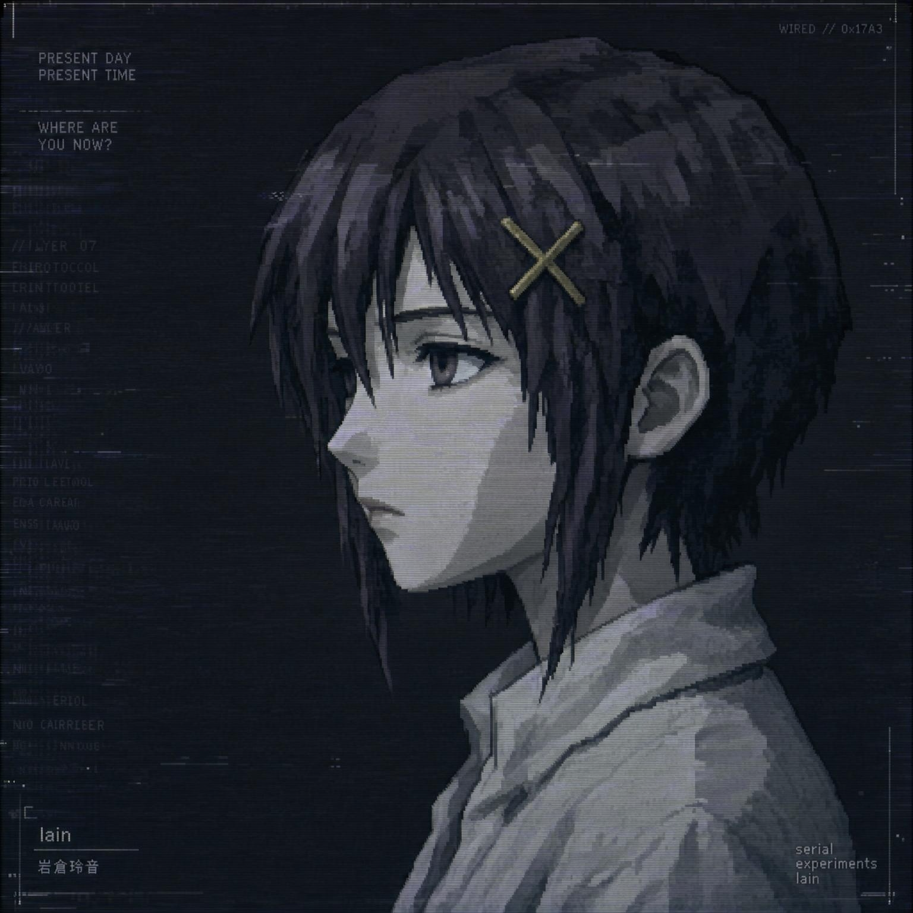

<div align="center">



# LainEcho

一个基于 Electron 的桌面 AI 桌宠应用：**Live2D 形象 / 2D 立绘 + 大模型对话 + 语音合成 + 角色卡 + 桌面迷你聊天**。

</div>

## ✨ 功能特性

| 模块 | 说明 |
|---|---|
| 桌宠形象 | **Live2D 模型 与 2D 立绘双形态**，可全局选择或按角色卡绑定；无边框透明窗口、始终置顶、可拖动、滚轮缩放 |
| 2D 立绘 | 立绘集管理（多张情绪图 + 说话图 + 思考图）；情绪 → 立绘映射，随对话情绪切换立绘 |
| 主题系统 | 深色 / 浅色 / 跟随系统三模式，跨窗口实时同步，防白屏闪烁 |
| AI 对话 | 兼容 OpenAI 格式 API，SSE 流式输出（打字机效果）；**结构化 JSON 输出**，一段回复内按情绪节拍切换立绘 |
| 语音合成 | **双引擎**：小米 MiMo 声音克隆（云端）+ **GenieTTS 本地声库**（离线）；段级/整段合音可选，口型同步驱动 |
| 桌面迷你聊天 | 桌宠上直接内置会话内容框 + 输入框，**与聊天窗口实时同步**（流式、高亮、切换会话、发送） |
| 角色卡 | 动漫角色复刻人设（锚点/内心结构/感知方式/关系模式/「你的身份」/语言质感/状态系统/世界观碎片/禁止项，支持 AI 生成草稿），可绑定模型/立绘/参考音频/表情映射 |
| 记忆体 | 用户手动维护的全局固定记忆条目 + **自动沉淀候选**（会话结束后自动抽取，需确认后生效） |
| 上下文管理 | 自动摘要压缩（旧历史超阈值时 LLM 生成摘要）、Token 预算装填、手动压缩 |
| 会话管理 | 多会话、切换、删除、搜索/筛选、重命名、导出 Markdown；桌宠与聊天窗双端同步 |
| 数据管理 | 自定义数据存放位置并一键迁移 |
| 应用更新 | 基于 electron-updater，GitHub Actions 在推送 `v*` 标签时自动构建发布 |
| 安全 | API Key 经 safeStorage(DPAPI) 加密落盘，仅主进程内存中解密使用 |

### 桌宠窗口

桌宠窗口自上而下为「会话内容框（半透明浮层）→ Live2D/立绘模型 → 聊天输入框」：

- **内容框**折叠为右下角一颗「会话」胶囊，点击展开为半透明浮层叠在模型上方；可收起 / 拖高，状态持久记忆
- **输入框**随时可发送，与聊天窗同会话同步；发送时内容框自动展开
- 模型区高度恒定，内容框发生/收起**不影响模型显示大小**

### Live2D 参数引擎

每帧由自定义参数引擎驱动（执行顺序：用户参数 → 表情 → 眨眼 → 眼神 → 口型同步）：

- **用户参数**：头部旋转、眼睛开合、眉毛、嘴巴、身体、呼吸等 20+ 参数可调
- **表情系统**：解析模型 `exp3.json`，支持 Add / Multiply / Overwrite 三种混合模式，防残留机制
- **眨眼**：Auto 模式（SDK 内置曲线）+ Force 模式（自定义状态机，3~8s 随机间隔）
- **鼠标跟踪**：屏幕任意位置鼠标跟踪（主进程 33ms 轮询），lerp 缓动，1s 超时切空闲眼神
- **空闲眼神**：加权概率扫视间隔（800~4400ms），focusController 驱动头部旋转
- **口型同步**：RMS 时域振幅分析实时驱动嘴部参数，指数平滑 + 增益，淡入淡出防爆音

### 语音合成（TTS）

双引擎架构，支持云端声音克隆与本地离线合成：

#### MiMo 声音克隆（云端）

基于小米 [MiMo](https://mimo.mi.com/docs/zh-CN/api/audio/tts) 声音克隆模型（`mimo-v2.5-tts-voiceclone`）：

- **参考音频管理**：导入 wav/mp3（建议 5-30s 干净人声），重命名/删除，导入时检测 WAV 时长并给质量提示
- **段级合成**：回复按 dialogue 段逐段合成并播放，语速稳定、句间顺滑；双队列流水线并行（播第 N 段已合成第 N+1 段）
- **低延迟**：剥离括号旁白只朗读台词，整段纯旁白跳过不合成

#### GenieTTS 本地声库（离线）

基于 [GenieTTS](https://github.com/High-Logic/Genie-TTS) 本地声库语音服务（GPT-SoVITS 轻量 CPU 推理引擎）：

- **本地推理**：~200MB 运行时 + 声库模型，无需联网，隐私安全
- **角色 TTS 模型卡**：管理多个本地声库角色，每个角色绑定 onnx 模型目录与参考音频
- **自动服务管理**：可一键启动/停止 GenieTTS 服务，支持自动检测服务状态
- **多语言支持**：中文/日文，日语模式自动翻译中文文本为日语合成
- **G2P 崩溃规避**：文本预处理规避 Genie 中文 G2P 越界崩溃，保证合成稳定性

#### 通用特性

- **口型同步**：桌面窗 AudioContext 实时驱动嘴部开合
- **整段合音**：开启后一段回复的多个合成分段合并为整段一次合成（音调更连贯），代价是失去逐句实时朗读与逐句切立绘
- **角色级覆盖**：每角色可独立配置 TTS 语言、声音模式（MiMo/GenieTTS/禁用）与自动播放
- **触发无关入口**：无论从聊天窗或桌宠入口发送，回复完成后由主进程统一触发语音

## 🧠 记忆系统

### 手动记忆

用户手动维护的全局固定记忆条目，每次请求前实时拼接注入 system prompt。

### 自动沉淀

会话结束后，后台自动从对话内容抽取候选记忆（用户信息/长期经历/约定与承诺），需用户确认后生效：

- **候选机制**：自动抽取的记忆为"待确认"状态，不注入 system prompt，避免错误记忆污染对话
- **分类管理**：按主题分类（用户信息/长期经历/约定与承诺），支持按角色隔离
- **确认流程**：设置 → 记忆 → 查看待确认候选 → 确认/删除

## 角色卡 · 人设体系

借鉴动漫角色复刻设计，人设由多个维度构成（按注入 system prompt 的优先级排序），只注入填写的部分：

| 维度 | 作用 |
|---|---|
| 存在锚点 | 1-3 句话定性角色本质，优先级最高 |
| 内心结构 | 核心渴望 / 内在恐惧 / 核心矛盾 / 自我认知状态 |
| 感知方式 | 注意什么 / 情绪处理机制 / 对外部世界的态度 |
| 关系模式 | 靠近人的方式 / 亲密节奏 / 边界 / 对"被需要"的态度 |
| 你的身份 | 你是谁 / 你们的关系 / AI 角色怎么看你 / 特殊约定或记忆 |
| 语言质感 | 说话节奏 / 用词特征 / 不会说的话 / 特殊语言行为 |
| 状态系统 | 日常状态 / 触发开关 / 不同情境下的状态变化 |
| 世界观碎片 | 角色会真实说出口的零碎观点 |
| 禁止项 | 绝不能出现的表达，最高优先级硬性边界 |

### AI 生成人设

输入角色名 + 角色来源描述（原作设定 / 台词 / 简介），让 LLM 按上述结构生成 JSON 草稿并回填编辑器。

- **部分生成**：AI 自动填充各人设维度；`你的身份` 中涉及你与角色私密关系的内容由你手填
- 产物为草稿，需逐项确认后才入库；生成失败自动修复尾逗号、字符串内换行等常见 JSON 瑕疵

## 🚀 快速开始

```bash
npm install

# 开发模式（启动 Vite dev server + Electron）
npm run dev

# 类型检查
npm run typecheck

# 仅构建（产出 dist/ + dist-electron/）
npm run build

# 打包 Windows 安装包（NSIS）
npm run build:win

# 由 build/icon.png 重新生成多尺寸 icon.ico
npm run icon
```

## 🧩 Live2D Cubism Core（必需）

Cubism Core（`live2dcubismcore.min.js`）是 Live2D 官方闭源专有 SDK，**不能打包进仓库或安装包**，需要首次使用时手动导入：

1. 前往 [Live2D 官网](https://www.live2d.com/sdk/download/web/) 下载 **Cubism SDK for Web**（推荐 `CubismSdkForWeb-5-r.4`）
2. 解压后在 `Core/` 中找到 `live2dcubismcore.min.js`
3. 打开应用 → 设置 → **角色模型** → 点击「导入运行库」选择该文件

> 未导入 Cubism Core 时桌宠窗口会提示，Live2D 无法渲染。

## 🧸 导入 Live2D 模型

1. 准备一个包含 `xxx.model3.json` 的模型文件夹（Cubism 3 及以上格式）
2. 设置 → **角色模型** → 「从文件夹导入」
3. 导入会**整体复制**到 `userData/models/{modelId}/`，原文件夹移动/删除不影响应用
4. 点击模型卡片设为「当前选择」，角色卡未绑定模型时默认使用该模型

模型文件夹下的 `exp3.json` / `*.motion3.json` 需在 `model3.json` 中声明才能被识别：

```json
{
  "FileReferences": {
    "Expressions": [
      { "Name": "开心", "File": "happy.exp3.json" },
      { "Name": "害羞", "File": "shy.exp3.json" }
    ],
    "Motions": {
      "Idle": [ { "File": "idle.motion3.json" } ]
    }
  }
}
```

## 🖼️ 2D 立绘

- **立绘集**：一组情绪图片（neutral / happy / sad / angry / surprised / shy）+ 说话的图片 + 思考的图片
- **情绪映射**：在立绘集上点击按钮，可为每个情绪指定立绘图
- **绑定方式**：角色卡 → 形象呈现模式选「2D 立绘动画 / 2D 立绘」，绑定某立绘集；不绑定则用全局当前立绘集
- 对话时立绘随 AI 情绪节拍切换；思考态显示思考图，说话态显示说话图

## 🗣️ 配置语音合成

### MiMo 声音克隆（云端）

1. 前往 [MiMo 开放平台](https://mimo.mi.com/) 注册并获取 API Key
2. 设置 → **语音合成** → 引擎选择「MiMo 声音克隆」→ 填写 MiMo API Key 和模型名（如 `mimo-v2.5-tts-voiceclone`）
3. 导入参考音频（建议 5-30 秒干净人声，wav/mp3 格式）
4. 在角色卡中绑定参考音频，即可在 AI 回复时自动合成语音并驱动桌宠口型同步

### GenieTTS 本地声库（离线）

1. 下载并安装 [GenieTTS](https://github.com/High-Logic/Genie-TTS)
2. 设置 → **语音合成** → 引擎选择「GenieTTS 本地声库」
3. 配置 GenieTTS 环境目录（含 python.exe）和 GenieData 资源目录
4. 点击【启动服务】等待服务就绪（或手动启动 GenieTTS 服务）
5. 创建 TTS 模型卡：填写角色名、onnx 模型目录、参考音频（可选）
6. 在角色卡中绑定 TTS 模型卡，即可在 AI 回复时自动合成语音

> TTS API Key 与 LLM API Key 隔离加密存储，互不影响。

## 📁 数据存储

所有数据位于 Electron `userData` 目录（Windows 默认：`%APPDATA%/LainEcho/`），可在设置 → Data 中自定义存放位置：

```
userData/
├── data/
│   ├── characterCards.json     # 角色卡
│   ├── memory.json             # 全局记忆体（含待确认候选）
│   ├── settings.json           # 非敏感配置（baseURL、model、textSpeed 等）
│   ├── model-settings.json     # 模型设置（缩放/位置/动画/表情）
│   ├── voice-settings.json     # TTS 非敏感配置（语言、引擎、整段合音）
│   ├── tts-genie-config.json   # GenieTTS 本地声库配置（baseUrl、workPath、dataDir）
│   ├── tts-model-cards.json    # TTS 模型卡（本地声库角色绑定）
│   ├── sprites-index.json      # 2D 立绘集索引
│   ├── secure/
│   │   ├── apiKey.enc          # safeStorage 加密的 LLM API Key
│   │   └── voiceApiKey.enc     # safeStorage 加密的 MiMo TTS API Key
│   ├── voices/
│   │   ├── index.json          # 参考音频索引
│   │   └── voice_xxx.wav       # 参考音频文件
│   └── sessions/               # 会话索引 + 单个会话消息（含摘要）
├── models/{modelId}/           # 导入的 Live2D 模型副本
├── sprites/{spriteId}/         # 导入的 2D 立绘图片
├── live2d-core/                # 用户手动导入的 Cubism Core
└── data-dir-config.json        # 自定义数据目录配置（仅在自定义时存在）
```

**数据迁移**：设置 → Data → 数据存放位置 →「更改位置」，选择新目录后数据会复制过去（含参考音频、立绘、模型、运行库），需手动重启应用生效，原目录数据不删除。

## 🔧 技术栈

- **桌面框架**：Electron 37（`contextIsolation` + `sandbox` + 白名单 preload）
- **前端**：React 19 + TypeScript + Vite 6
- **样式**：Tailwind CSS v4
- **动画**：framer-motion；**状态**：Zustand
- **Live2D**：pixi.js v6 + pixi-live2d-display（动态 import `/cubism4` 子路径）
- **TTS**：小米 MiMo voiceclone API（云端）+ GenieTTS（本地离线）+ Web Audio API 口型同步
- **打包**：electron-builder（Windows NSIS，可选安装目录，卸载时删除应用数据）
- **更新**：electron-updater + GitHub Actions
- **自定义协议**：`pet-res://` 服务本地模型/立绘资源（路径穿越防护）

## 🪟 窗口

| 窗口 | 唤起方式 |
|---|---|
| 桌宠窗口 | 应用启动即显示；托盘菜单可显隐；右键菜单 |
| 聊天窗口 | 桌宠右上角按钮、托盘菜单（桌宠有会话时直接进入该会话） |
| 设置窗口 | 桌宠右上角按钮、聊天窗口右上角 ⚙、托盘菜单 |

## ⚠️ 已知限制

- 记忆条目过多时的 token 截断策略（目前全量拼接）
- 模型空闲动作的细节待优化
- 目前仅支持 Windows 打包目标
- GenieTTS 仅支持 CPU 推理，无 GPU 加速

## 🔒 安全设计要点

- `nodeIntegration: false`、`contextIsolation: true`、`sandbox: true`
- preload 仅暴露白名单方法，渲染进程拿不到 `ipcRenderer` 原始对象
- API Key 明文永不进入渲染进程；AI 请求与 TTS 合成全部由主进程代理
- LLM API Key 与 MiMo TTS API Key 隔离加密存储
- 模型/立绘导入复制到受控目录，`pet-res://` 协议做路径穿越防护
- 数据写入采用原子策略（`.tmp` → `rename`），同一文件串行化队列防并发丢更新

## 📄 License

本项目仅供个人学习与研究使用，未经授权不得用于商业用途。